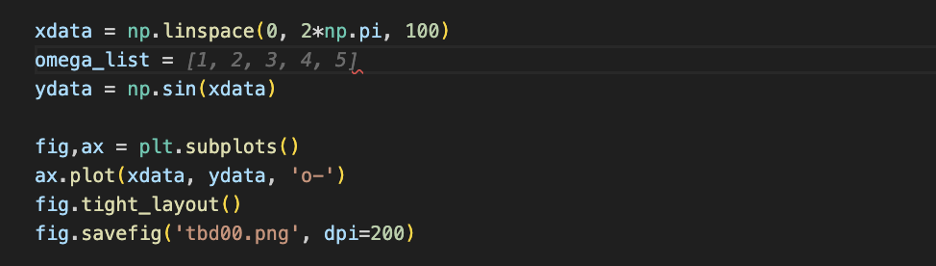

# Large Language Model

also see `python/openai/README.md`

前言

1. 该文档中Large Language Model (LLM)一般特指ChatGPT/GPT4，
2. 该文档只记录「LLM可能的使用场景」，不记录任何天马行空的预测，不做任何「LLM会取代人类工作」断言
3. ChatGPT/GPT-4/Bard均提供了feedback选项，如果LLM提供的答案不尽如人意，可以考虑反馈以帮助提升LLM

可操作的建议

1. 申请个钟waitlist
   * Microsoft, New bing [blog-link](https://blogs.bing.com/search/march_2023/Confirmed-the-new-Bing-runs-on-OpenAI%E2%80%99s-GPT-4)
   * Google, Bard
   * GitHub, copilot x [blog-link](https://github.blog/2023-03-22-github-copilot-x-the-ai-powered-developer-experience/)
   * GPT plugin
   * GPT4 api
   * Baidu, 文心一言
2. 创建一个新用户的Chrome窗口用于GPT相关事务
   * 新用户窗口与之前用户窗口的插件独立，方便启用VPN
   * LLM页面
     * openai/GPT4: non mainland/HK VPN
     * New bing
     * Bard: US/UK VPN
     * Poe
     * ChatPDF: 上传pdf然后对话
     * 安装chrome插件 GPT-prompter, ChatGPTBox
3. 在vscode中开启Github Copilot选项
   * Cursor
4. Telegram chat bot
5. 其他
   * 建议每个thread有一个明确的主题。GPT4在一个thread表现出了极强的连贯性，但胡乱对话会破坏这种连贯性

## Applications based on LLM

1. Reference
   * Openai community [openai-link](https://community.openai.com/)
   * Easy-with-ai [web-link](https://easywithai.com/)
   * openai/api-examples [link](https://platform.openai.com/examples)
   * openai/documentaion/prompt-design [link](https://platform.openai.com/docs/guides/completion/prompt-design)
   * openai-cookbook/ techniques to improve reliability [github-link](https://github.com/openai/openai-cookbook/blob/main/techniques_to_improve_reliability.md)
   * github/awesome-LLM [link](https://github.com/Hannibal046/Awesome-LLM)
   * github/awesome-gpt4 [link](https://github.com/radi-cho/awesome-gpt4)
   * github/awesome-chatgpt [link](https://github.com/OpenMindClub/awesome-chatgpt)
   * github/prompt-learning [github-link](https://github.com/trigaten/Learn_Prompting) [website](https://learnprompting.org/)
   * Briefgpt [website](https://briefgpt.xyz/) arxiv文章中文简介
   * GPT-4 Technical Report [link](https://cdn.openai.com/papers/gpt-4.pdf)
   * Sparks of Artificial General Intelligence: Early experiments with GPT-4 [arxiv-link](https://arxiv.org/abs/2303.12712)
   * GPTs are GPTs: An Early Look at the Labor Market Impact Potential of Large Language Models [arxiv-link](https://arxiv.org/abs/2303.10130)
   * DeID-GPT: Zero-shot Medical Text De-Identification by GPT-4 [arxiv-link](https://arxiv.org/abs/2303.11032)
   * github/learning-prompt [github-link](https://github.com/thinkingjimmy/Learning-Prompt)
2. TODO
   * github/chatgpt-academic [github-link](https://github.com/binary-husky/chatgpt_academic)
   * github/chatpaper [github-link](https://github.com/kaixindelele/ChatPaper)
   * 阅读这些github代码，学习openai api key的用法
3. GPT-prompter
   * chrome/firefox/edge插件
   * [youtube/demo-link](https://www.youtube.com/watch?v=NIUzxYfKZ7g) [github-link](https://github.com/giosilvi/GPT-Prompter)
   * 选中文字，代入提示词
   * 应用场景：translate TEXT, repharize TEXT
   * 类似应用
     * ChatGPTBox [bilibili/demo-link](https://www.bilibili.com/video/BV1524y1x7io) [github-link](https://github.com/josStorer/chatGPTBox) 支持GPT4
4. ChatPDF [link](https://www.chatpdf.com/)
   * 上传pdf或者URL链接然后对话
   * PROMPT: the key contribution
   * PROMPT: list the key reference
   * 类似应用
     * [Discord-link](https://community.openai.com/t/chatpdf-com-chat-with-any-pdf-using-the-new-chatgpt-api/81446) Chat with any PDF using the new ChatGPT API
     * GPT4-pdf-chatbox-langchain [link](https://github.com/mayooear/gpt4-pdf-chatbot-langchain) [youtube/demo-23min](https://www.youtube.com/watch?v=ih9PBGVVOO4) 阅读56页的pdf，然后根据pdf内容问答 配置略复杂未测试
     * [Pdfgpt](https://pdfgpt.io/) link 不大聪明
     * 维护糟糕 ChatPaper [github-link](https://github.com/kaixindelele/ChatPaper) [web-link](https://chatpaper.org/)
     * Microsoft Edge + newBing
5. GitHub copilot, cursor
   * [github/cursor-link](https://github.com/getcursor/cursor)
   * PROMPT
     * new file draft00.cu
     * cuda convolution2d
     * Detect bug
     * How to compile
   * PROMPT: matplotlib draw a unicorn
   * PROMPT
     * Pytorch model with several fully connected layer
     * Load MNIST dataset
     * Train this model on MNIST dataset for 4 epochs
   * PROMPT
     * Generate random hermitian matrix, tab, tab
     * Unittest, tab, tab
6. Book by GPT4: Impromptu: Amplifying our Humanity through AI [twitter-link](https://twitter.com/reidhoffman/status/1636006090927390720) [pdf-link](https://www.impromptubook.com/wp-content/uploads/2023/03/impromptu-rh.pdf)
7. GitHub/BlenderGPT [github-link](https://github.com/gd3kr/BlenderGPT)
   * 输入英文自然语言，执行blender代码，例如创建对象，控制对象属性
8. TODO extract paper to PowerPoint
9. TODO Input latex, output latex-slide
10. TODO summarize paper
11. Schedule a conference [github-link](https://github.com/stephanj/Scheduling-using-GPT4)
12. Debug typescript code 复制粘贴整个代码文件 [twitter-link](https://twitter.com/mayowaoshin/status/1635757442859671553)
13. GPT4 Khan Academy in depth demo YouTube-link
14. MS loop: no AI yet
15. ChatPaper: 不大智能，总结的错误比较明显，而且等待时间比较长，有每日限额

## Prompt

待整理

1. Github/awesome-chatgpt-prompts
2. Github/awesome-chatgpt-prompts-zh
3. youtube/ChatGPT-Prompt-Engineering
4. Github/ChatGPT-shortcut github-link web-link 网页展示了一些常见的提示语，复制粘贴即可使用
5. Prompt Engineering 教程 [link](https://learningprompt.wiki/)

记号说明

1. Q1/Q2/Q3表示独立对话，Q1a/Q1b/Q1c表示依次对话
2. 对于显著不正确的回答可以点击「regenerate responses」或者引导提问「not correct」
3. `[xxx]`表示替换为合适的内容
4. 可以直接输入 LaTeX 公式

concrete prompt

1. 文献调研
   * Q1 你知道Mary Beth Ruskai吗
   * Q2 你能讲讲她的主要贡献和代表作吗
2. 编程
   * Q1 what api to contract tensors in pytorch
   * Q2 what’s wrong with my codes
3. 文献调研
   * Q1a do you know Gell-Mann matrices
   * Q1b how about the generalized Gell-Mann matrices, let’s say with d columns and d rows
   * Q1c can you give some others Hermitian matrix basis besides Gell-Mann matrices
   * Q2 Can you explain this title to me: `[xxx]`
4. Paper writing
   * Q1 This is the conclusion part of a paper: `[xxx]`
   * Q2 can you write a title for it
   * Q3 can you polish following paragraph in [xxx, e.g. PRL, NC] style
   * Q4 can you reprahse the following sentence (Paste other people’s introduction in here )
   * Q5 I am struggling on the choice of following options of verb within title, can you vote for them with corresponding reason. (to run such query, the context should at least include the abstract of target paper)
5. Paper writing: abstract, introduction
   * Q1 `[xxx]` help me paraphrase more academically and fluently
6. Paper writing
   * Q1 write an abstract part for the topic `[xxx]`
7. Paper writing
   * 给gpt看了“Uniqueness of Quantum States Compatible with Given Measurement Results”这篇文章的intro，跟它说要写个新paper用variational method，请生成一下新的intro
8. Email editing
9. Writing with the specific style: “I am writing a experiment report example for the students, could you help me rearrange the structure and polish it?”

## miscellaneous

一些不太有道理但的确可以问的问题

1. 游戏
   * Q1 have you heard Genshin Impact
   * Q2 I am a new player, can you given some advice
   * Q3 Can you play as a dungeon master and run an open world adventure for dungeons & dragons
2. 数学问题
   * Q1 do you know rational orthogonal matrix
   * Q2 can you give me some rational orthogonal matrix examples
3. 法律政策
   * Q1 if i got driver’s license in Hong Kong, can i drive the car in mainland China
   * Q2 what about vice versa
4. 领域调研
   * Q1 do you know the latest progress in quantum computing field
5. misc
   * Q1 what day is it today
   * PROMPT: I am an English learner. In the following conversation, could you rephrase my speaking in a more natural way and then reply that? acknowledge this with a “….” answer

TODO youtube/ChatGPT-Prompt-Engineering

1. PROMPT: I want you to act as CRITIC. Acknowledge this with a “...” answer
2. PROMPT: critice the following [xxx] and convince me that it can be better. Lets think about the problems with [xxx] in step by step
3. PROMPT: Great points. Rewrite the text and improve it based on your critic

## Comparison between LLM

### New bing

1. 需要开启内容访问权限 blog-link

### Google Bard

文字润色能力不如GPT4，下图为分别使用GPT4/Bard润色Pure Bosonic extension文章的摘要部分 [arxiv-link](https://arxiv.org/abs/2209.10934)

### Baidu 文心一言

TODO

Vicuna

1. [link](https://chat.lmsys.org/)
2. 个人评价：not bad

### Github Copilot

Python

个人评语：这个工具的使用体验很奇妙，它能够感知上下文，它似乎能够捕捉逻辑变化

Step-1 以下是一段朴素的绘制sin函数的代码

Step-2 笔者尝试绘制不同omega的sin(omega x)曲线（淡灰色部分是Copilot提示）也许训练集中包含大量类似代码

Step-3 计算不同omega下的ydata

Step-4 绘制不同omega下的曲线

Step-5 笔者尝试刁难Copilot，将ydata数据转置

LaTeX / Markdown

Github Copilot Lab

1. 代码解释
2. Debug
3. （TODO demo picture requried）代码翻译，例如 `python -> c++`

## Access ChatGPT in HK/mainland

写在开头：强列建议使用quora/poe，这个省心；除非你需要使用chatgpt api key，额加油

Mainland users

1. Chatgpt镜像站
   * [theb-link](https://chatbot.theb.ai/) 无需注册，偶尔出现网络错误
2. Chrome插件
   * Chatgpt for chrome [webstore-link](https://chrome.google.com/webstore/detail/chatgpt-for-chrome-search/ninecedhhpccjifamhafbdelibdjibgd) 对网络要求比较宽松，偶尔出现无法访问的情形

quora/poe

1. link
   * poe暂时只提供ios/web服务，仅支持ios/macOS-silicon端付费 @20230324
   * Poe免费版包含chatgpt，付费版包含gpt4
   * poe不对大陆提供服务，poe对HK提供服务
2. 开销估计
   * `1600HKD/year`
   * 苹果手机/macOS-silicon
3. 流程概述
   * （中国大陆）购买VPN服务
   * 免费版：打开poe网页即可
   * 付费版：ios端点击订阅（需要非大陆信用卡）

openai/chatgpt

1. Link
   * 稀土掘金/sms-activate一款好用的短信验证码接收工具 [link](https://juejin.cn/post/7211437215335727164)
   * 稀土掘金/国内开通chatgpt-plus保姆级教程 [link](https://juejin.cn/post/7201806164392656953#heading-4)
   * sms-activate [link](https://sms-activate.org/)
   * 欧易交易平台 [link](https://www.okx.com/cn)
   * depay数字货币master卡 [link](https://www.depay.one/zh-cn/index.html)
   * USDT
2. 开销预估：约 `35USD/month`
   * sms-activate 短信验证码 大约10RMB 仅首次
   * vultr-US-NewJearsy服务器 `3.5USD/month`
   * 欧易交易USDT手续费 `1USDT/transaction`
   * depay开卡费 `10USDT` 仅首次
   * depay月费 `0.5USDT/month`
   * depay充值手续费率 `1.3%`
   * openai plus订阅费 `20USD/month`
   * openai api key：按需
3. 流程概述，详见上链接
   * sms-activate接收短信注册openai账号
   * 购买服务器vultr-US-NJ用作VPN，已测试AWS-JP-Tokyo, AWS-US-Ohio被openai封禁
   * 注册欧易平台账号用于充值depay，并购买USDT
   * 注册depay账号并开通master卡
   * 欧易平台转账至depay卡
   * Openai绑定depay卡并订阅
4. http/https代理策略有较大概率触发NetworkError, socks代理更为顺畅
   * socks代理包括shadowsocks, v2ray
   * http/https代理包括github/proxy.py
   * 在firefox/setting/network页面可以确认当前使用的代理模式，如使用socks代理务必在勾选上「dns over socks」

Telegram-Chat bot

1. Unofficial ChatGPT telegram-link
